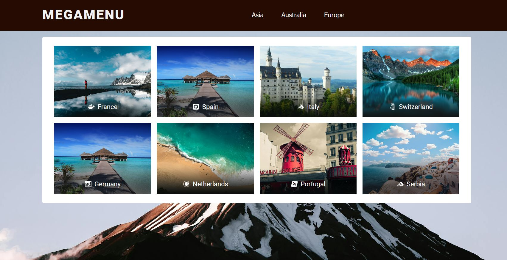

## React Mega-Menu Project

**Project URL:**
https://react-mega-menu-1111.netlify.app/

**Key Features:**

- Custom submenu design depending on the number of submenu items.
- Hide submenu with the help of useRef() and getBoundingClientRect().

